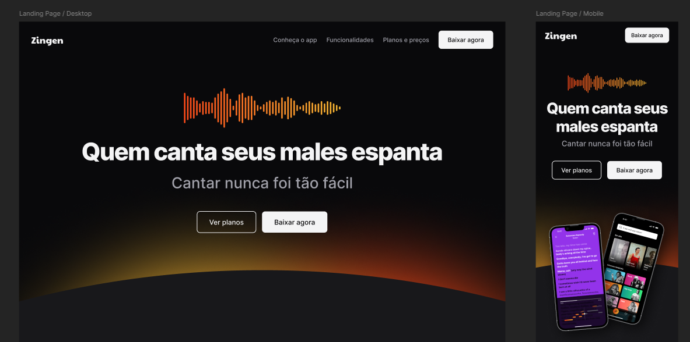

<h1 align="center"> Landing Page Zingen </h1>

  Projeto desenvolvido com o curso da Rocketseat.  
  <strong>Neste projeto o objetivo principal e trabalhar os conceitos de responsividade, adaptando a landing page em smartphones e desktop.</strong>

  <a href="#-tecnologias">Tecnologias</a>&nbsp;&nbsp;&nbsp;|&nbsp;&nbsp;&nbsp;
  <a href="#-projeto">Projeto</a>&nbsp;&nbsp;&nbsp;

 

  
    

## 🚀 Tecnologias

Esse projeto foi desenvolvido com as seguintes tecnologias:

- HTML e CSS
- Git e Github
- Figma

## 💻 Projeto

Esta página traz um lading page do Zingen um aplicativo de karaokê para você se aprender enquanto canta.🎶

---

Feito com ♥ by May
